# BH View

> React Native (Expo + TypeScript) mobile application for the BH Hunter platform.

BH View is a multi-role mobile application that enables tenants to discover and book boarding houses while providing property owners with tools to manage listings, bookings, payments, and business operations.

---

# Features

### Tenant

- Browse nearby boarding houses
- Interactive map-based property discovery
- Room reservation and booking
- Booking history and stay management
- Reviews and bookmarks

### Owner

- Property and room management
- Booking approval workflow
- Dashboard and business analytics
- Tenant management

### Platform

- JWT Authentication
- PayMongo payment integration
- Role-based navigation
- Document verification
- Push notifications
- MapLibre geospatial search

## Application Flow

```
Tenant

    ↓

Discover Boarding House

    ↓

View Rooms

    ↓

Submit Booking Request

    ↓

Owner Review

    ↓

Booking Approval

    ↓

Required Payment Stages

    ↓

Approved Stay Period
```

---

# Screenshots

| Login                                | Tenant Registration                          | Owner Registration                          |
|--------------------------------------|----------------------------------------------|---------------------------------------------|
| <p align="center"> 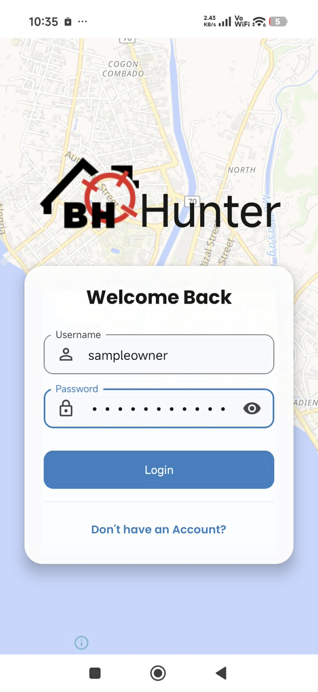 </p> | <p align="center"> 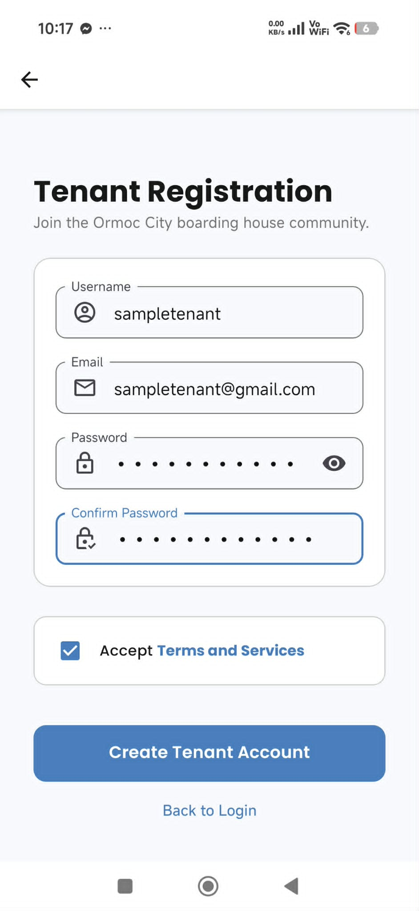 </p> | <p align="center"> 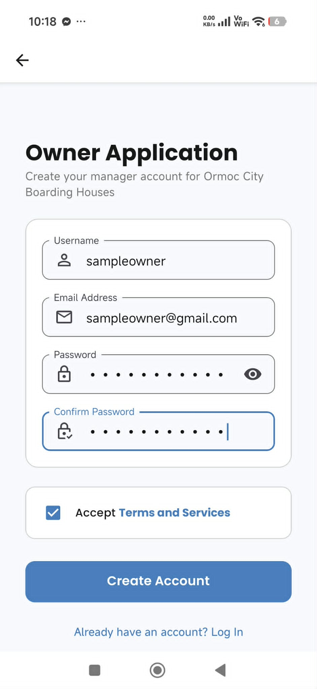 </p> |
<!-- |  |  |  | -->

## Tenant Experience

### Dashboard

<!-- 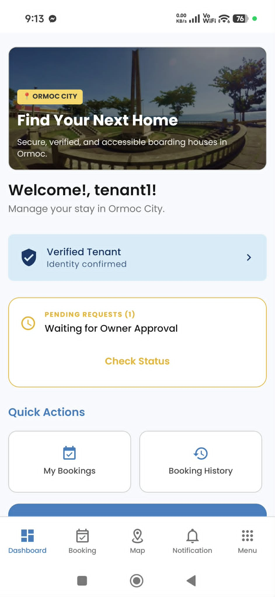 -->
<p align="center">

</p>

Browse featured boarding houses and personalized recommendations.

---

### Interactive Map Discovery

The application includes a MapLibre-powered map for discovering nearby boarding houses. Property markers are populated from the backend based on active listings and owner subscription status.

*Screenshot omitted because the archived backend environment is no longer available.*

---

### Boarding House Details

<!-- 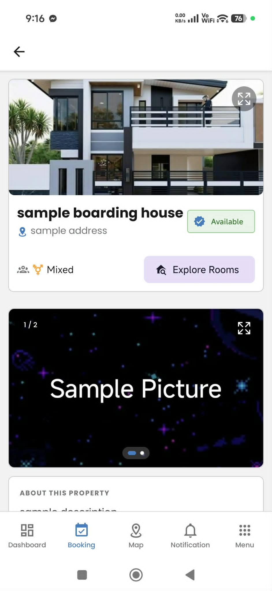 -->
<p align="center">  </p>

View property information, amenities, images, and available rooms.

---

### Room Selection

<!-- 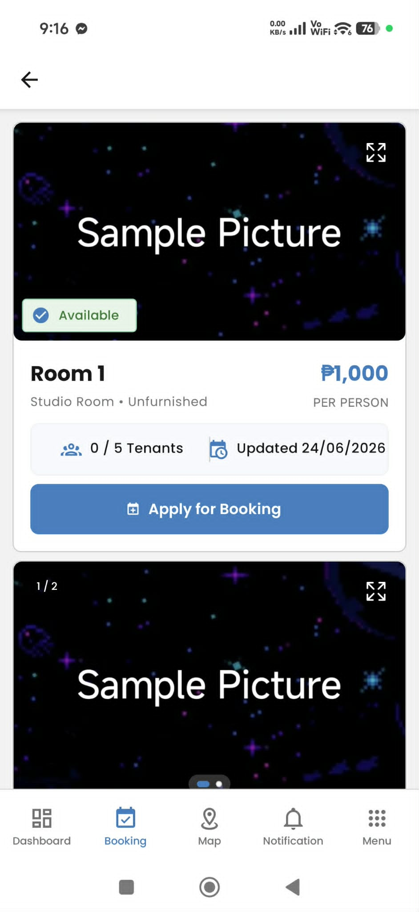 -->
<p align="center">  </p>

Browse room availability before making a reservation.

---

### Booking Request

<!-- 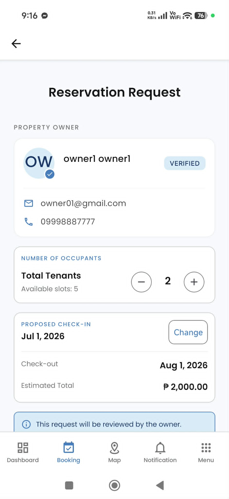 -->
<p align="center">  </p>

Review booking details before proceeding to payment.

---

### Booking Status

<!-- 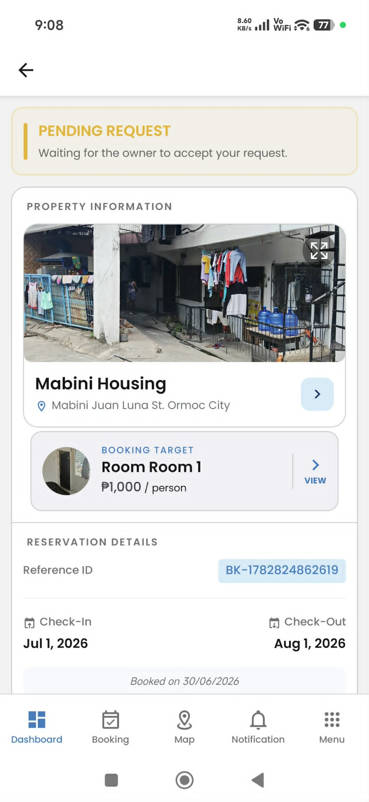 -->
<p align="center">  </p>

Track reservation progress, payments, and booking lifecycle.

## Owner Experience

### Dashboard

<!-- 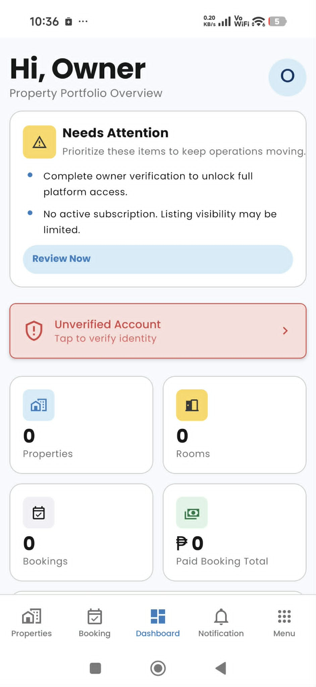 -->
<p align="center">  </p>

Overview of bookings, occupancy, and business metrics.

---

### Property Management

<!-- 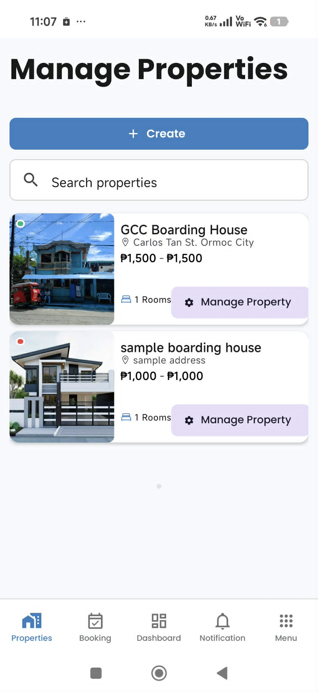 -->
<p align="center">  </p>

Manage boarding house listings and property information.

---

### Booking Management

<!-- 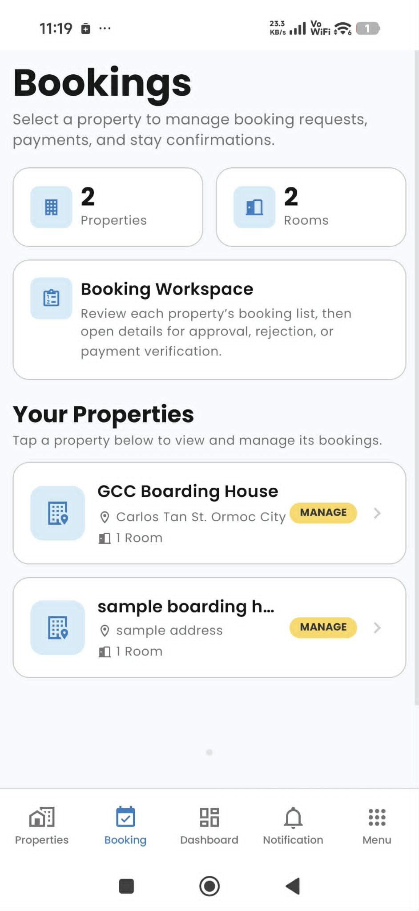 -->
<p align="center">  </p>

Review, approve, or decline reservation requests.

---

## Shared Features

### Verification

| Tenant Verification                                               | Owner Verification                                  |
|-------------------------------------------------------------------|-----------------------------------------------------|
| <p align="center"> 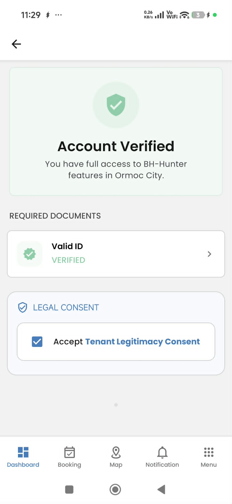 </p> | <p align="center"> 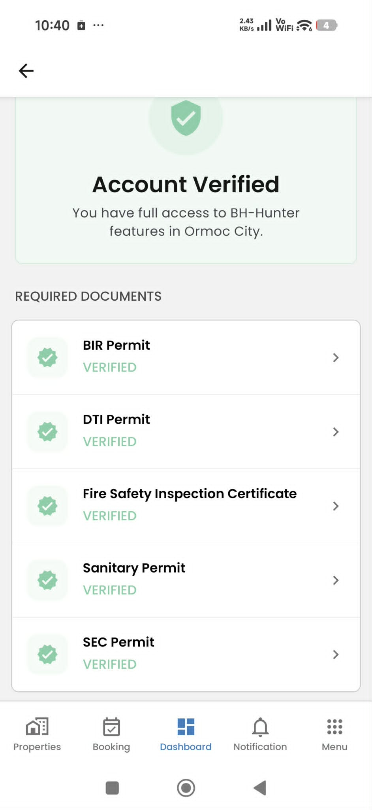 </p> |

<!-- <p align="center">  </p> -->

Identity verification workflow for users and property owners.

---

### Reviews

Tenants can submit a single review and rating for each boarding house after their stay. The platform provides aggregated ratings and review summaries to help future tenants evaluate listings.

*Screenshot unavailable in the archived project documentation.*

---

### Notifications

The notification interface is shared across user roles, with content varying based on user activity and permissions.

---

### Profile

<!-- 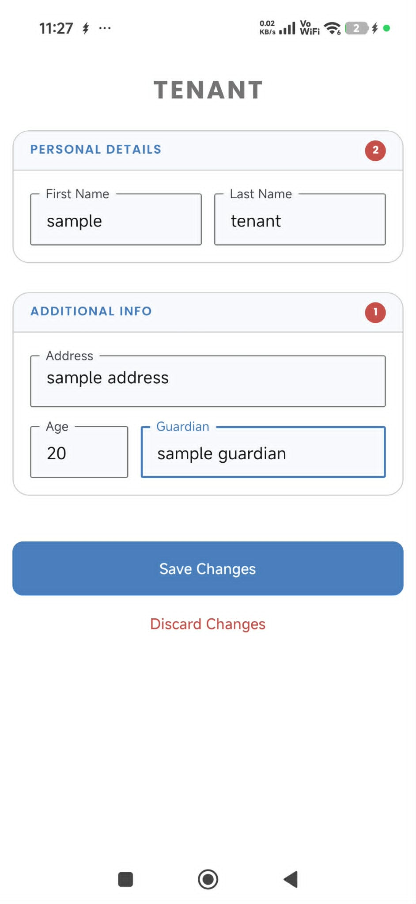 -->
<p align="center">  </p>

Manage personal information and account settings.

## Tech Stack

- React Native 0.76
- Expo SDK 52
- TypeScript
- Redux Toolkit
- React Query
- React Navigation
- MapLibre
- Gluestack UI
- Expo SecureStore
- PayMongo
- EAS Build

## Architecture

The application follows a feature-first modular architecture to improve maintainability and scalability.

```
src/
├── application/      # App bootstrap, navigation, configuration
├── features/         # Feature modules (tenant, owner, auth)
├── infrastructure/   # API layer, services, Redux
├── components/       # Shared UI components
├── assets/           # Fonts, images, icons
└── constants/        # Theme and global configuration
```

This separation keeps business logic, presentation, and infrastructure concerns isolated across the application.

## Technical Highlight

- Multi-role application architecture
- Feature-first module organization
- JWT authentication with persistent sessions
- Interactive MapLibre integration
- REST API communication with NestJS backend
- Booking lifecycle management
- PayMongo payment workflow
- Role-based navigation guards

## Known Limitations

- Legacy admin module remains in the repository but is no longer maintained.
- Some navigation flows remain deeply nested due to project evolution.
- Deep linking support is partially implemented.

## Related Projects

| Repository | Description |
|------------|-------------|
| [BH Hunter Backend](https://github.com/PrimeVoid918/bh-hunter-core) | NestJS backend API |
| [BH Hunter Web](https://github.com/PrimeVoid918/bh-hunter-core/tree/main/frontend) | React + Vite web application |
| **BH View** | React Native mobile application (this repository) |
